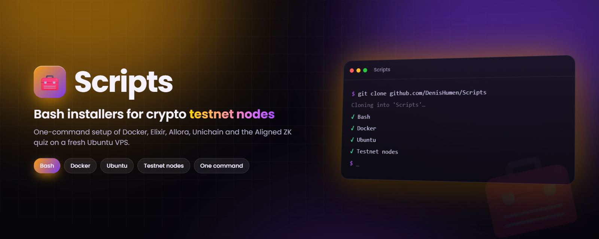

<div align="center">



# Scripts

**One-shot Bash installers for crypto testnet nodes and the tools they need — Docker, Elixir, Allora, Unichain and the Aligned ZK quiz.**

[](#-scripts)
[](#-requirements)
[](#-scripts)
[](https://github.com/DenisHumen/Scripts/commits/main)

**English** · [Русский](README.ru.md)

[Scripts](#-scripts) · [Quick start](#-quick-start) · [Before you run](#before-you-run) · [Known issues](#-known-issues)

</div>

---

A small collection of Bash scripts that set up crypto nodes and the components they depend on, so a fresh VPS can
be brought up with a single command. Each script is standalone: it installs its prerequisites with `apt`, pulls the
node's Docker image or repository, and starts it. They were written for Ubuntu servers administered as `root`.

> [!WARNING]
> These scripts run as root, upgrade system packages, execute code downloaded from other repositories and — for
> some nodes — ask for a wallet private key or seed phrase. Read [Before you run](#before-you-run) and
> the script itself first, and only use dedicated testnet wallets.

## 📜 Scripts

| Script | What it does | Needs | Status |
|---|---|---|---|
| [`install_docker.sh`](install_docker.sh) | Installs Docker CE (`docker-ce`, `docker-ce-cli`, `containerd.io`) from Docker's official apt repository and the standalone `docker-compose` binary (latest GitHub release) into `/usr/bin`. `-d` also installs [Dive](https://github.com/wagoodman/dive) 0.9.2; `-u` removes Docker completely; `-h` prints help. | Ubuntu, x86_64, `sudo` | ✅ |
| [`install_elixir_validator.sh`](install_elixir_validator.sh) | Sets up an **Elixir Protocol** validator (`ENV=testnet-3`): installs `curl` and `docker.io`, asks for your wallet address, private key and validator name, writes `validator.env`, pulls `elixirprotocol/validator:v3` and runs it as container `elixir` on port `17690`, then tails its logs. | root, run from `/root` | ⚠️ testnet-3 |
| [`elixir_update.sh`](elixir_update.sh) | Updates that validator: stops and removes the `elixir` container, pulls `elixirprotocol/validator:v3` again and restarts it with `/root/validator.env`. | Docker, existing `/root/validator.env` | ⚠️ testnet-3 |
| [`install_allora.sh`](install_allora.sh) | Installs an **Allora** worker (basic coin prediction node): asks for the wallet seed phrase (unless `ALLORA_SEED_PHRASE` is set), clones `allora-network/basic-coin-prediction-node` into `$HOME`, fetches and fills in `config.json`, runs `init.config`, remaps published port `8000` → `18000`, tries to add 10m/20m/1h intervals to `model.py`, writes `.env` (ETH, 30 training days, 4h timeframe, LinearRegression, Binance) and starts it with `docker compose up -d --build`. | Docker + Compose plugin, `git`, `wget` | ❌ [see issues](#-known-issues) |
| [`install-unichain.sh`](install-unichain.sh) | Installs a **Unichain** node on Sepolia: installs `curl`, `git`, `net-tools`, clones `Uniswap/unichain-node` into the current directory, fetches a prepared `.env.sepolia`, installs Docker with `install_docker.sh` from this repo and runs `docker compose up -d`. | root, Ubuntu x86_64 | ❌ [see issues](#-known-issues) |
| [`ZK-proof.sh`](ZK-proof.sh) | Interactive helper for the **Aligned Layer zkquiz**: optionally installs dependencies (base packages, UFW, Rust, Foundry) via third-party scripts, optionally imports a wallet into a Foundry keystore, runs `make answer_quiz` if the wallet holds 0.004 ETH (the quiz answers it prints: Nakamoto, Pacific, Green), and optionally deletes the checkout and keystore afterwards. | root, an existing `~/aligned_layer` checkout | ⚠️ [see issues](#-known-issues) |

✅ no known issues · ⚠️ works with caveats · ❌ depends on a file that no longer exists

## 🚀 Quick start

### Run directly from GitHub

No clone needed. Use process substitution rather than `curl | bash`, so the interactive prompts can still read
from your terminal:

```bash
bash <(curl -s https://raw.githubusercontent.com/DenisHumen/Scripts/main/install_docker.sh)
```

Replace `install_docker.sh` with any script from the table. Options go after the substitution:

```bash
bash <(curl -s https://raw.githubusercontent.com/DenisHumen/Scripts/main/install_docker.sh) --dive
```

### Or clone the repository

```bash
git clone https://github.com/DenisHumen/Scripts.git
cd Scripts
bash install_docker.sh
```

Update your copy later with:

```bash
git pull
```

## 🧭 Usage

### `install_docker.sh`

```bash
bash install_docker.sh            # Docker CE + docker-compose
bash install_docker.sh -d         # ...plus Dive (image analyser)
bash install_docker.sh -u         # uninstall Docker and delete ALL images and containers
bash install_docker.sh -h         # help
```

Existing installations are detected (`docker --version`, `docker-compose --version`) and skipped.

### Elixir validator

```bash
cd /root
bash install_elixir_validator.sh
```

Before running it, the script asks you to request test tokens from the faucet
(<https://faucet.quicknode.com/drip>) and to mint and stake tokens on <https://testnet-3.elixir.xyz/>. Then it
prompts for the wallet address, private key and validator name. Useful commands afterwards:

```bash
docker logs -f elixir             # follow the validator logs
bash elixir_update.sh             # pull the latest v3 image and restart
```

### Allora worker

```bash
bash install_allora.sh
```

Set `ALLORA_SEED_PHRASE` in the environment beforehand to skip the prompt. The node lives in
`~/basic-coin-prediction-node`; manage it with `docker compose` from that directory.

### Unichain node

```bash
bash install-unichain.sh
```

The node is created in `./unichain-node`; see <https://github.com/Uniswap/unichain-node> for operating it.

### Aligned ZK quiz

```bash
bash ZK-proof.sh
```

Answer the four prompts with `1` (yes) or `2` (no): install dependencies, import a wallet, confirm the wallet holds
0.004 ETH (this runs the quiz), delete the data afterwards.

## 📋 Requirements

- Ubuntu server with `apt` (`install_docker.sh` reads `DISTRIB_ID`/`DISTRIB_CODENAME` from `/etc/lsb-release` and
  adds Docker's repository for `amd64` only).
- Bash 4+ and internet access.
- Root: most scripts call `apt` without `sudo` and use paths under `/root`.

<a id="before-you-run"></a>

## ⚠️ Before you run

- **System changes.** `install_docker.sh`, `install_elixir_validator.sh` and `install-unichain.sh` run
  `apt upgrade -y`, upgrading every package on the machine.
- **Remote code.** Several scripts execute code fetched from other repositories at run time:
  `install_docker.sh` sources `colors.sh` (and `logo.sh` for `--help`) from `SecorD0/utils`;
  `ZK-proof.sh` pipes `main.sh`, `ufw.sh`, `rust.sh` and `foundry.sh` from `DOUBLE-TOP/tools` into `bash`;
  `install-unichain.sh` runs `install_docker.sh` from this repository; most scripts print the banner from
  [DenisHumen/Logo](https://github.com/DenisHumen/Logo) the same way. What those files do can change without
  any change here.
- **Firewall.** At the time of writing, the `ufw.sh` used by `ZK-proof.sh` enables UFW and denies outgoing traffic
  to private ranges (`10.0.0.0/8`, `192.168.0.0/16`, `100.64.0.0/10`, `198.18.0.0/15`, `169.254.0.0/16`), which
  can cut a VPS off from its private network or cloud metadata service.
- **Secrets on disk.** `install_elixir_validator.sh` stores the validator's private key in plain text in
  `validator.env`; `install_allora.sh` appends the wallet seed phrase in plain text to `~/.profile`. Use
  throwaway testnet wallets, never your main one.
- **Destructive options.** `install_docker.sh -u` deletes `/var/lib/docker`, i.e. every image, container and
  volume on the host. `ZK-proof.sh` can delete `~/aligned_layer` and the imported keystore when you answer `1`.

## 🐞 Known issues

| Script | Issue | Workaround |
|---|---|---|
| `install_allora.sh` | `config.json` is downloaded from `MeSmallMan/allora`, which now returns 404, so the worker is not configured. The `sed` meant to add 10m/20m/1h intervals to `model.py` uses unescaped brackets and never matches, and the last banner line has a typo (`curl -shttps://…`). | Finish the remaining steps by hand in `~/basic-coin-prediction-node` with your own `config.json`. |
| `install-unichain.sh` | `.env.sepolia` is downloaded from `DenisHumen/config-file`, which now returns 404. | Create `unichain-node/.env.sepolia` yourself (see the Unichain repository) and run `docker compose up -d`. |
| `ZK-proof.sh` | The `git clone` of `aligned_layer` is commented out, so `~/aligned_layer/examples/zkquiz` must already exist. The prompts expect a number; any other input makes the `[ -eq ]` test fail. | Clone `yetanotherco/aligned_layer` into `~/aligned_layer` first. |
| `install_elixir_validator.sh` | `validator.env` is written to the current directory but the container reads `/root/validator.env`. The on-screen hints mention `docker logs -f ev` and an update command with `/rootvalidator.env`. | Run it from `/root`; use `docker logs -f elixir` and `elixir_update.sh`. |

<details>
<summary><b>Legacy: <code>auto_update_elixir.py</code> (removed, no longer maintained)</b></summary>

This repository used to contain `auto_update_elixir.py`, which updated a fleet of Elixir validators and recorded
the result in MySQL. It was deleted in October 2024 and the project is obsolete; the notes are kept for reference.

It needed:

1. **A MySQL database**, reachable before the script starts.
2. **A table named `elixir`** with the columns `last_updated` (last update info) and `gray_ip` (node IP
   addresses), and a user with access to it (e.g. `root`).
3. **SSH access to every node**, over which it ran `elixir_update.sh`.

Connection settings looked like this:

```python
base = {
    'host': 'your_mysql_host',
    'user': 'your_mysql_user',
    'password': 'your_mysql_password',
    'database': 'your_database_name'
}
```

</details>

## 📁 Project structure

```
.
├── install_docker.sh              # Docker CE + docker-compose (+ Dive), or full uninstall
├── install_elixir_validator.sh    # Elixir Protocol validator (testnet-3) in Docker
├── elixir_update.sh               # re-pull and restart the Elixir validator
├── install_allora.sh              # Allora basic coin prediction worker
├── install-unichain.sh            # Unichain node (Sepolia)
└── ZK-proof.sh                    # Aligned Layer zkquiz helper
```

## 🤝 Contributing

Issues and pull requests are welcome — especially fixes for the [known issues](#-known-issues).

## 📄 License

License: not specified yet.
