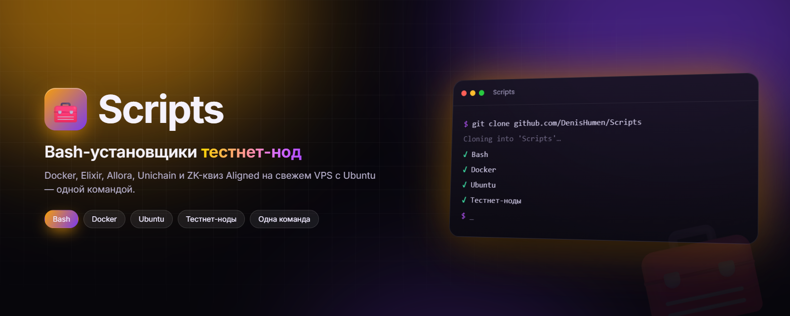

<div align="center">



# Scripts

**Bash-скрипты «в одну команду» для установки тестнет-нод и нужных им инструментов — Docker, Elixir, Allora, Unichain и ZK-квиз Aligned.**

[](#-скрипты)
[](#-требования)
[](#-скрипты)
[](https://github.com/DenisHumen/Scripts/commits/main)

[English](README.md) · **Русский**

[Скрипты](#-скрипты) · [Быстрый старт](#-быстрый-старт) · [Перед запуском](#before-you-run) · [Известные проблемы](#-известные-проблемы)

</div>

---

Небольшой набор Bash-скриптов для лёгкой установки и настройки крипто-нод и компонентов, от которых они зависят:
свежий VPS поднимается одной командой. Каждый скрипт самостоятелен — ставит зависимости через `apt`, скачивает
Docker-образ или репозиторий ноды и запускает её. Скрипты писались под серверы Ubuntu, которыми управляют от `root`.

> [!WARNING]
> Скрипты работают от root, обновляют системные пакеты, выполняют код, скачанный из других репозиториев, а для
> некоторых нод запрашивают приватный ключ или сид-фразу кошелька. Сначала прочитайте раздел
> [Перед запуском](#before-you-run) и сам скрипт и используйте только отдельные тестнет-кошельки.

## 📜 Скрипты

| Скрипт | Что делает | Что нужно | Статус |
|---|---|---|---|
| [`install_docker.sh`](install_docker.sh) | Ставит Docker CE (`docker-ce`, `docker-ce-cli`, `containerd.io`) из официального apt-репозитория Docker и отдельный бинарник `docker-compose` (последний релиз с GitHub) в `/usr/bin`. С `-d` дополнительно ставит [Dive](https://github.com/wagoodman/dive) 0.9.2; `-u` полностью удаляет Docker; `-h` — справка. | Ubuntu, x86_64, `sudo` | ✅ |
| [`install_elixir_validator.sh`](install_elixir_validator.sh) | Разворачивает валидатор **Elixir Protocol** (`ENV=testnet-3`): ставит `curl` и `docker.io`, спрашивает адрес кошелька, приватный ключ и имя ноды, записывает `validator.env`, скачивает `elixirprotocol/validator:v3` и запускает контейнер `elixir` на порту `17690`, после чего показывает логи. | root, запуск из `/root` | ⚠️ testnet-3 |
| [`elixir_update.sh`](elixir_update.sh) | Обновляет этот валидатор: останавливает и удаляет контейнер `elixir`, заново скачивает `elixirprotocol/validator:v3` и запускает его с `/root/validator.env`. | Docker, готовый `/root/validator.env` | ⚠️ testnet-3 |
| [`install_allora.sh`](install_allora.sh) | Ставит воркер **Allora** (basic coin prediction node): спрашивает сид-фразу кошелька (если не задана `ALLORA_SEED_PHRASE`), клонирует `allora-network/basic-coin-prediction-node` в `$HOME`, скачивает и заполняет `config.json`, запускает `init.config`, переназначает опубликованный порт `8000` → `18000`, пытается добавить интервалы 10m/20m/1h в `model.py`, пишет `.env` (ETH, 30 дней обучения, таймфрейм 4h, LinearRegression, Binance) и поднимает ноду через `docker compose up -d --build`. | Docker + плагин Compose, `git`, `wget` | ❌ [см. проблемы](#-известные-проблемы) |
| [`install-unichain.sh`](install-unichain.sh) | Ставит ноду **Unichain** в сети Sepolia: устанавливает `curl`, `git`, `net-tools`, клонирует `Uniswap/unichain-node` в текущий каталог, скачивает готовый `.env.sepolia`, ставит Docker скриптом `install_docker.sh` из этого репозитория и выполняет `docker compose up -d`. | root, Ubuntu x86_64 | ❌ [см. проблемы](#-известные-проблемы) |
| [`ZK-proof.sh`](ZK-proof.sh) | Интерактивный помощник для **Aligned Layer zkquiz**: по желанию ставит зависимости (базовые пакеты, UFW, Rust, Foundry) сторонними скриптами, импортирует кошелёк в keystore Foundry, запускает `make answer_quiz`, если на кошельке есть 0,004 ETH (ответы на квиз скрипт выводит сам: Nakamoto, Pacific, Green), и в конце может удалить проект и keystore. | root, уже склонированный `~/aligned_layer` | ⚠️ [см. проблемы](#-известные-проблемы) |

✅ известных проблем нет · ⚠️ работает с оговорками · ❌ зависит от файла, которого больше нет

## 🚀 Быстрый старт

### Запуск прямо с GitHub

Клонировать ничего не нужно. Используйте подстановку процесса, а не `curl | bash` — тогда интерактивные вопросы
смогут читать ответы из терминала:

```bash
bash <(curl -s https://raw.githubusercontent.com/DenisHumen/Scripts/main/install_docker.sh)
```

Вместо `install_docker.sh` подставьте любой скрипт из таблицы. Параметры указываются после подстановки:

```bash
bash <(curl -s https://raw.githubusercontent.com/DenisHumen/Scripts/main/install_docker.sh) --dive
```

### Или клонируйте репозиторий

```bash
git clone https://github.com/DenisHumen/Scripts.git
cd Scripts
bash install_docker.sh
```

Обновить локальную копию:

```bash
git pull
```

## 🧭 Использование

### `install_docker.sh`

```bash
bash install_docker.sh            # Docker CE + docker-compose
bash install_docker.sh -d         # ...плюс Dive (анализ образов)
bash install_docker.sh -u         # удалить Docker и ВСЕ образы и контейнеры
bash install_docker.sh -h         # справка
```

Уже установленные компоненты определяются (`docker --version`, `docker-compose --version`) и пропускаются.

### Валидатор Elixir

```bash
cd /root
bash install_elixir_validator.sh
```

Перед запуском скрипт просит запросить тестовые токены в кране (<https://faucet.quicknode.com/drip>), а затем
получить и застейкать токены на <https://testnet-3.elixir.xyz/>. После этого он спрашивает адрес кошелька,
приватный ключ и имя ноды. Полезные команды:

```bash
docker logs -f elixir             # логи валидатора
bash elixir_update.sh             # скачать свежий образ v3 и перезапустить
```

### Воркер Allora

```bash
bash install_allora.sh
```

Чтобы не вводить сид-фразу вручную, заранее задайте переменную окружения `ALLORA_SEED_PHRASE`. Нода
разворачивается в `~/basic-coin-prediction-node`; управляйте ею через `docker compose` из этого каталога.

### Нода Unichain

```bash
bash install-unichain.sh
```

Нода создаётся в `./unichain-node`; как с ней работать — см. <https://github.com/Uniswap/unichain-node>.

### ZK-квиз Aligned

```bash
bash ZK-proof.sh
```

На четыре вопроса отвечайте `1` (да) или `2` (нет): установить зависимости, импортировать кошелёк, подтвердить,
что на кошельке есть 0,004 ETH (это запускает квиз), удалить данные после завершения.

## 📋 Требования

- Сервер Ubuntu с `apt` (`install_docker.sh` берёт `DISTRIB_ID`/`DISTRIB_CODENAME` из `/etc/lsb-release` и
  подключает репозиторий Docker только для `amd64`).
- Bash 4+ и доступ в интернет.
- Права root: большинство скриптов вызывают `apt` без `sudo` и используют пути внутри `/root`.

<a id="before-you-run"></a>

## ⚠️ Перед запуском

- **Изменения в системе.** `install_docker.sh`, `install_elixir_validator.sh` и `install-unichain.sh` выполняют
  `apt upgrade -y` — то есть обновляют все пакеты на машине.
- **Удалённый код.** Некоторые скрипты во время работы выполняют код из других репозиториев:
  `install_docker.sh` подключает `colors.sh` (а для `--help` — `logo.sh`) из `SecorD0/utils`;
  `ZK-proof.sh` передаёт в `bash` скрипты `main.sh`, `ufw.sh`, `rust.sh` и `foundry.sh` из `DOUBLE-TOP/tools`;
  `install-unichain.sh` запускает `install_docker.sh` из этого репозитория; большинство скриптов так же выводят
  баннер из [DenisHumen/Logo](https://github.com/DenisHumen/Logo). Содержимое этих файлов может измениться без
  каких-либо изменений здесь.
- **Файрвол.** На момент написания `ufw.sh`, который вызывает `ZK-proof.sh`, включает UFW и запрещает исходящий
  трафик в частные диапазоны (`10.0.0.0/8`, `192.168.0.0/16`, `100.64.0.0/10`, `198.18.0.0/15`,
  `169.254.0.0/16`) — это может отрезать VPS от приватной сети или сервиса метаданных облака.
- **Секреты на диске.** `install_elixir_validator.sh` хранит приватный ключ валидатора открытым текстом в
  `validator.env`; `install_allora.sh` дописывает сид-фразу кошелька открытым текстом в `~/.profile`. Используйте
  одноразовые тестнет-кошельки, а не основной.
- **Разрушительные опции.** `install_docker.sh -u` удаляет `/var/lib/docker`, то есть все образы, контейнеры и
  тома на хосте. `ZK-proof.sh` может удалить `~/aligned_layer` и импортированный keystore, если ответить `1`.

## 🐞 Известные проблемы

| Скрипт | Проблема | Как обойти |
|---|---|---|
| `install_allora.sh` | `config.json` скачивается из `MeSmallMan/allora`, а этот адрес теперь отдаёт 404 — воркер остаётся ненастроенным. `sed`, который должен добавить интервалы 10m/20m/1h в `model.py`, использует неэкранированные скобки и ничего не находит. | Выполните оставшиеся шаги вручную в `~/basic-coin-prediction-node` со своим `config.json`. |
| `install-unichain.sh` | `.env.sepolia` скачивается из `DenisHumen/config-file`, а этот адрес теперь отдаёт 404. | Создайте `unichain-node/.env.sepolia` сами (см. репозиторий Unichain) и выполните `docker compose up -d`. |
| `ZK-proof.sh` | `git clone` репозитория `aligned_layer` закомментирован, поэтому `~/aligned_layer/examples/zkquiz` должен уже существовать. Ответы должны быть числами: любой другой ввод ломает проверку `[ -eq ]`. | Предварительно склонируйте `yetanotherco/aligned_layer` в `~/aligned_layer`. |
| `install_elixir_validator.sh` | `validator.env` записывается в текущий каталог, а контейнер читает `/root/validator.env`. В подсказках на экране — `docker logs -f ev` и команда обновления с опечаткой `/rootvalidator.env`. | Запускайте из `/root`; используйте `docker logs -f elixir` и `elixir_update.sh`. |

<details>
<summary><b>Архив: <code>auto_update_elixir.py</code> (удалён, больше не поддерживается)</b></summary>

Раньше в репозитории был скрипт `auto_update_elixir.py`: он обновлял группу валидаторов Elixir и записывал
результат в MySQL. В октябре 2024 года он был удалён, проект устарел; описание оставлено для справки.

Ему требовались:

1. **База данных MySQL**, настроенная и доступная до запуска скрипта.
2. **Таблица `elixir`** с колонками `last_updated` (информация о последнем обновлении) и `gray_ip` (IP-адреса
   нод), а также пользователь с доступом к ней (например, `root`).
3. **Доступ к каждой ноде по SSH** — через него запускался `elixir_update.sh`.

Параметры подключения выглядели так:

```python
base = {
    'host': 'your_mysql_host',
    'user': 'your_mysql_user',
    'password': 'your_mysql_password',
    'database': 'your_database_name'
}
```

</details>

## 📁 Структура проекта

```
.
├── install_docker.sh              # Docker CE + docker-compose (+ Dive) или полное удаление
├── install_elixir_validator.sh    # валидатор Elixir Protocol (testnet-3) в Docker
├── elixir_update.sh               # обновление и перезапуск валидатора Elixir
├── install_allora.sh              # воркер Allora (basic coin prediction)
├── install-unichain.sh            # нода Unichain (Sepolia)
└── ZK-proof.sh                    # помощник для Aligned Layer zkquiz
```

## 🤝 Участие в разработке

Issues и pull requests приветствуются — особенно исправления [известных проблем](#-известные-проблемы).

## 📄 Лицензия

Лицензия пока не указана.
